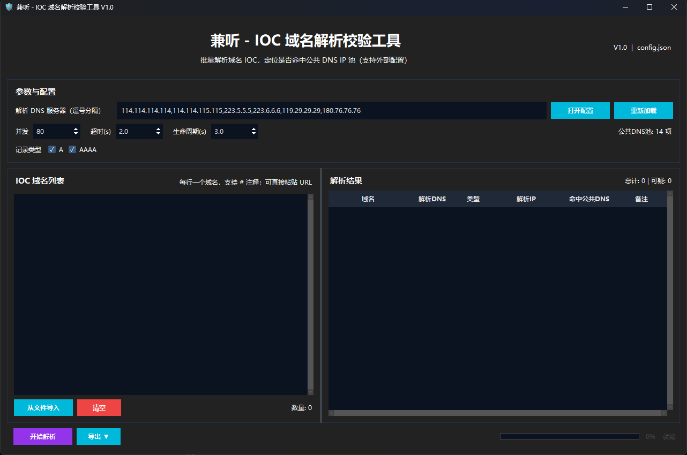
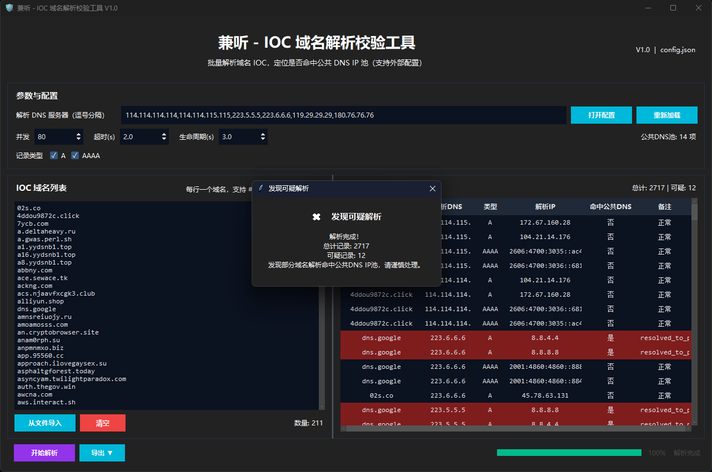

# 兼听 (IOCHunter) - 高并发 IOC 域名解析校验工具

“兼听 (IOCHunter)”是一款专为安全运营（SecOps）和威胁情报（TI）分析师打造的高性能桌面端便携工具。主要用于批量对海量 IOC（恶意域名）进行并发 DNS 解析，以快速验证这些域名是否已被内部网络、安全设备或运营商拦截，并指向了**公共 DNS/Sinkhole（黑洞）IP 池**。

**💡 核心优势：开箱即用，零依赖。专为解决“百万级解析任务下的界面卡死与内存溢出”而生。**

## 📥 下载与运行 (开箱即用)

本工具为绿色便携版，**无需安装 Python 环境或任何依赖**。

1. 前往 [Releases](#) 页面下载最新版本的`IOCHunter_v1.0.zip`。解压后即可得到`IOCHunter_v1.0.exe`。
2. 将程序放置在任意目录，双击运行即可。
3. 首次运行会自动在同级目录生成 `config.json` 配置文件。

## ✨ 核心特性

* 🚀 **极限高并发与防假死架构**
    * 采用底层线程池纯后台异步执行，支持自定义并发数、超时时间和生命周期。
    * **$O(1)$ 极速去重**：实测导入数十万条恶意域名，瞬间完成哈希去重过滤。
    * **UI 攒批渲染与熔断机制**：彻底解决 Tkinter 在海量数据下的组件崩溃问题。**实测单机 350 万并发解析任务下，主界面依然丝滑拖拽，零卡顿。**
    * **安全中断**：支持在海量任务执行中途随时“急刹车”，立即中止并结算已出结果，杜绝僵尸线程堆积。
* 🛡️ **智能分析与警报**
    * 零配置自动比对 `config.json` 中的 Public DNS 池。
    * 发现可疑 Sinkhole 命中后，界面触发**深红色高亮预警**及独立弹窗提示。
* 📊 **异步海量数据导出**
    * 支持导出**详细报告**与**唯一 IP 聚合报告**（XLSX / HTML / CSV）。
    * 导出操作被完全剥离至后台线程，几万条数据的 Excel 单元格着色与绘制全程不阻塞主界面操作。
* 🎨 **现代化桌面视觉体验**
    * 深度定制的极简“科技蓝”与深色模式（Dark Mode），全局深色标题栏自适应。
    * 底层调用 Windows API 显式声明 DPI 感知，**彻底消除高分屏/缩放下的 UI 模糊与锯齿**。

## 📸 界面预览

* ## 📸 运行截图

* ## 📸 风险高亮预警截图

## 🛠️ 高级配置 (`config.json`)

程序运行后，可通过界面上的【打开配置】按钮直接编辑外部配置：
* `public_dns_servers`: 全局公共 DNS IP 池（用于判定域名是否被黑洞拦截）。
* `default_query_dns_servers`: 默认用于执行解析查询的 DNS 节点库（支持内网 DNS）。
## 🤝 贡献与反馈
欢迎提交 Issue 或 Pull Request。如果在实战情报解析中遇到新的场景需求（如自动化联动、特定代理支持），请随时反馈探讨。
